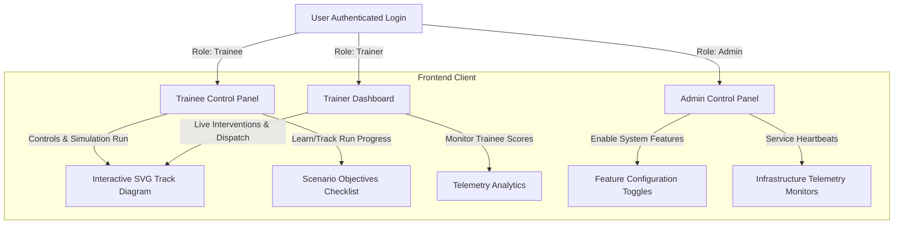
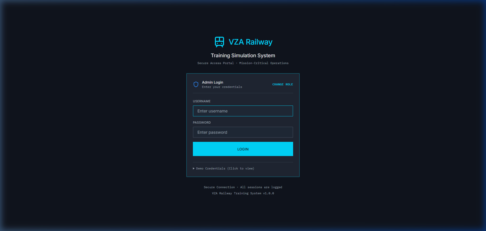
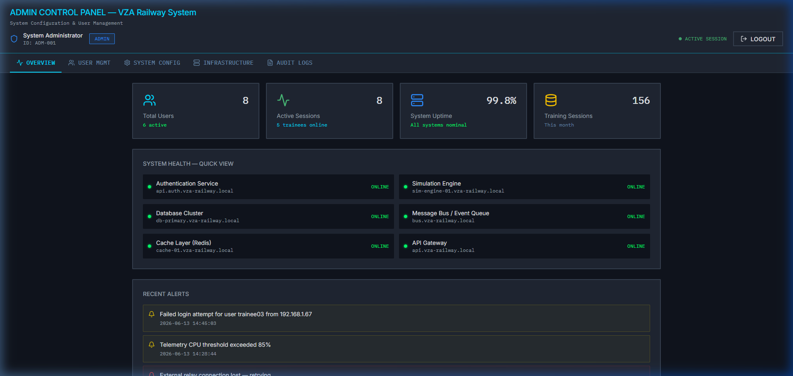
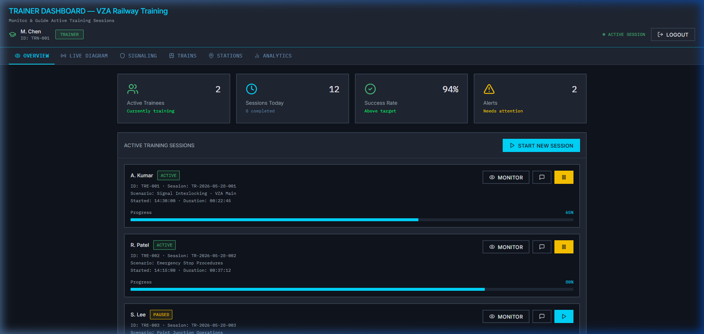
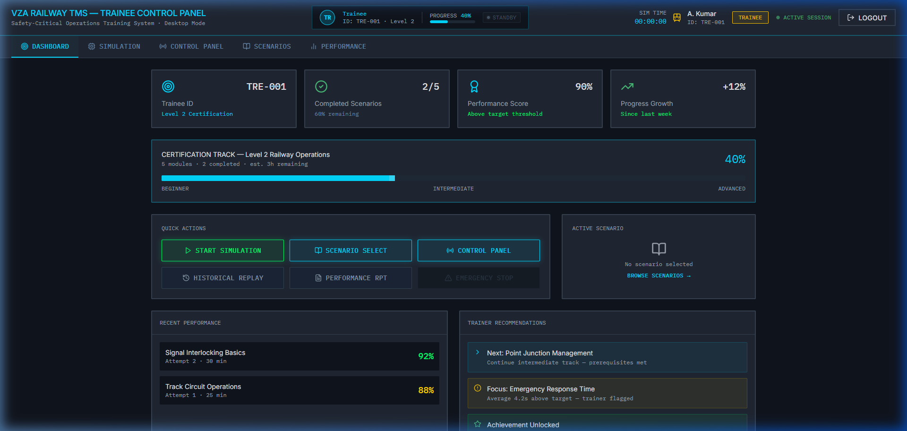

# 🚄 VZA Railway Training Simulation & Management System (TMS)

This repository contains the interactive control panel interfaces and simulation dashboard system for the **VZA Railway Training System**, enabling role-based training operations, live track switch controls, real-time analytics, and supervisor interventions.

---

## 🏛️ System Architecture

The VZA Railway TMS functions as a collaborative system divided into three core user interfaces communicating through an event-driven router:



---

## 💻 Tech Stack

### Frontend Application (Implemented)
* **Core Framework:** React 18 & TypeScript (Type-safe component properties and event handling)
* **Build Tool:** Vite 6 (Fast HMR development environment)
* **Styling Engine:** Tailwind CSS v4 (Sleek dark-industrial components utilizing custom CSS variables in [theme.css](file:///c:/Users/kasis/Downloads/Untitled/src/styles/theme.css))
* **Icons Library:** Lucide React (Industrial panel symbols and indicators)
* **Visualization Engine:** Recharts (Interactive SVG charting components for performance logs)

### Proposed Backend Services (Architected)
* **Runtime Environment:** Node.js (with TypeScript)
* **Web Server Framework:** Express.js (REST API handlers)
* **Real-time Engine:** Socket.io (Bi-directional trainee-trainer synchronization via WebSockets)
* **Database Systems:**
  * **PostgreSQL:** Persistent data storage for user accounts, historical sessions, safety incidents, and audit trails.
  * **Redis:** In-memory caching for active session coordinates, live telemetry packets, and Socket rooms.

---

## 📋 System Requirements

* **Node.js:** v18.0.0 or higher
* **Package Manager:** `npm` (v9+) or `pnpm` (v8+)
* **Browser:** Modern desktop browser supporting HTML5 SVG capabilities (optimized for $1920 \times 1080$ screen layouts)

---

## ✨ Features & User Roles

### 1. 🎓 Trainee Panel ([TraineeDashboard](file:///c:/Users/kasis/Downloads/Untitled/src/app/components/TraineeDashboard.tsx))
* Run predefined training modules with step-by-step checklists.
* Interact with dynamic routes (e.g. `VZA` → `MRT`) and switch track junctions.
* Simulate environmental limitations (Heavy Rain, Dense Fog, Snow/Ice) that restrict speeds and increase breaking distances.
* Trigger a manual Emergency Stop.
* Play back completed runs frame-by-frame.

### 2. 👨‍🏫 Trainer Dashboard ([TrainerDashboard](file:///c:/Users/kasis/Downloads/Untitled/src/app/components/TrainerDashboard.tsx))
* Monitor live coordinates and speeds of trainee trains on a schematic SVG map.
* Pause, resume, or terminate active trainee sessions.
* Inject simulated malfunctions (e.g. track blockages or points jams) to test trainee troubleshooting.
* Generate and export PDF reports detailing telemetry trends and energy regenerations.

### 3. ⚙️ System Administrator Panel ([AdminDashboard](file:///c:/Users/kasis/Downloads/Untitled/src/app/components/AdminDashboard.tsx))
* Approve, suspend, or configure user profiles and role parameters.
* Modify central settings like session timeout duration and maximum concurrent connections.
* View status metrics and resource limits of microservice instances.
* Inspect complete system logs.

---

## 📸 Output Screens

### 🔐 Multi-Role Login Portal


### ⚙️ Administrator Control Panel


### 👨‍🏫 Trainer/Supervisor Dashboard


### 🎓 Trainee Simulation & Control Panel


---

## 🚀 Running the Code

### Installation

1. Clone the project code bundle and navigate to the directory:
   ```bash
   cd Untitled
   ```
2. Install the frontend dependencies:
   ```bash
   npm install
   ```

### Development Server

Run the local Vite development server:
```bash
npm run dev
```
Open [http://localhost:5173](http://localhost:5173) in your web browser.

### Building for Production

Compile and bundle assets for deployment:
```bash
npm run build
```

---

## 🔑 Demo Credentials

To access the various dashboards, log in on the [LoginScreen](file:///c:/Users/kasis/Downloads/Untitled/src/app/components/LoginScreen.tsx) with the following credentials:

| Role | Username | Password | Access Details |
| :--- | :--- | :--- | :--- |
| **Administrator** | `admin001` | `admin123` | System config, user directory, server monitors |
| **Trainer/Supervisor** | `trainer01` | `trainer123` | Live monitoring, dispatcher controls, reports |
| **Trainee** | `trainee01` | `trainee123` | Active runs, route controls, weather modifiers |